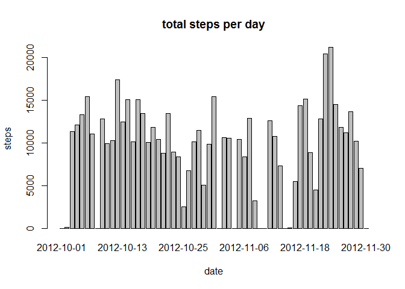
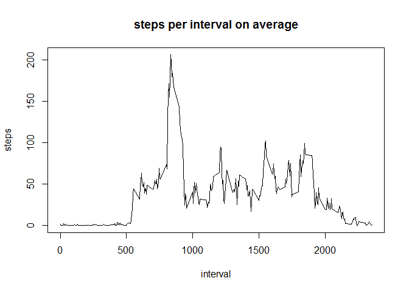
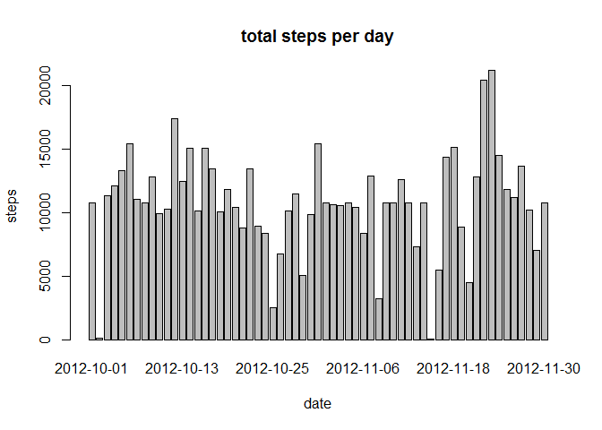
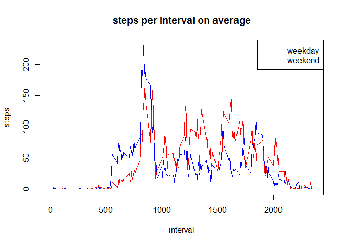

# Reproducible Research: Peer Assessment 1
Chua Li Fu  


### Preparation

Before we begin, let us load the necessary libraries to be safe.
Let us also set echo=TRUE so as to display results.


```r
library(knitr)
library(ggplot2)
library(plyr)
opts_chunk$set(echo=TRUE, results="show", cache=TRUE)
```

### Loading and preprocessing the data

Loading of data is straightforward, unzipping and reading directly from CSV.


```r
unzip("activity.zip")
main <- read.csv("activity.csv")
main$date <- as.Date(main$date)
str(main)
```

```
## 'data.frame':	17568 obs. of  3 variables:
##  $ steps   : int  NA NA NA NA NA NA NA NA NA NA ...
##  $ date    : Date, format: "2012-10-01" "2012-10-01" ...
##  $ interval: int  0 5 10 15 20 25 30 35 40 45 ...
```

### Get the total number of steps each day

We ignore the data by setting na.rm=TRUE and perform the function, SUM.


```r
steps.Total <- aggregate(x = main$steps, by = list(main$date), FUN=sum, na.rm=TRUE)
names(steps.Total) <- c("date", "steps")
barplot(steps.Total$steps, names.arg=steps.Total$date,
        main="total steps per day", xlab="date", ylab="steps")
```

 

### Get the mean and median of steps

MEAN and MEDIAN are easily calculated with their respective functions.


```r
mean(steps.Total$steps)
```

```
## [1] 9354.23
```

```r
median(steps.Total$steps)
```

```
## [1] 10395
```

### Get the average daily pattern

We perform a MEAN function across all the days, grouped by intervals.


```r
steps.Interval <- aggregate(steps ~ interval, data=main, FUN=mean)
plot(steps.Interval, type="l", main="steps per interval on average")
```

 

### Determine the max interval

We identify the index which has the max number, and retrieve interval from there.


```r
steps.maxSteps <- which.max(steps.Interval$steps)
steps.Interval$interval[steps.maxSteps]
```

```
## [1] 835
```

### Determine number of missing values

We perform a SUM on rows that are NA.


```r
sum(is.na(main$steps))
```

```
## [1] 2304
```

### Create new dataset with NAs filled in

As we are no longer ignoring the NAs, we fill it in with the mean of that interval.  
We have to perform a conversion to integer, as they are footsteps.


```r
impute.mean <- function(x) replace(x, is.na(x), mean(x, na.rm=TRUE))
main.Filled <- ddply(main, ~interval, transform, steps=impute.mean(steps))
main.Filled$steps <- as.integer(main.Filled$steps)
```

### Recalculate total number of steps each day

We reperform the SUM function.  
We note that there are some additional bars where there were none in previous chart.


```r
steps.Total2 <- aggregate(x = main.Filled$steps, by = list(main.Filled$date), FUN=sum, na.rm=TRUE)
barplot(steps.Total2$x, names.arg=steps.Total2$Group.1,
        main="total steps per day", xlab="date", ylab="steps")
```

 

```r
names(steps.Total2) <- c("date", "steps")
```

### Recalculate mean and median of steps

We reperform the MEAN and MEDIAN functions.  
We note that the values has increased as we are adding the MEAN to the NAs.


```r
mean(steps.Total2$steps)
```

```
## [1] 10766.19
```

```r
median(steps.Total2$steps)
```

```
## [1] 10766.19
```

### Set day from date and aggregate them

We perform the Weekday() function to get the day. 
An IFELSE function will convert it to Weekday or Weekend.  
We then rename and conver the steps values to integer.


```r
main.Filled$day <- ifelse(weekdays(main.Filled$date) %in% c("Saturday","Sunday"),
                          "Weekend", "Weekday")
steps.Interval2 <- aggregate(x = main.Filled$steps,
                             by = list(main.Filled$interval, main.Filled$day),
                             FUN=mean)
names(steps.Interval2) <- c("interval", "day", "steps")
steps.Interval2$steps <- as.integer(steps.Interval2$steps)
str(steps.Interval2)
```

```
## 'data.frame':	576 obs. of  3 variables:
##  $ interval: int  0 5 10 15 20 25 30 35 40 45 ...
##  $ day     : chr  "Weekday" "Weekday" "Weekday" "Weekday" ...
##  $ steps   : int  2 0 0 0 0 1 0 1 0 1 ...
```

### Split them into two for plotting

We split them into two data frames for easy plotting.  
Overlay plot was chosen as it can easily perform direct comparison between weekday and weekend.


```r
steps.Weekday <- subset(steps.Interval2, day=="Weekday")
steps.Weekend <- subset(steps.Interval2, day=="Weekend")
plot(steps.Weekday$steps ~ steps.Weekday$interval, type="l", col="blue",
     main="steps per interval on average", xlab="interval", ylab="steps")
lines(steps.Weekend$steps ~ steps.Weekend$interval, col="red")
legend("topright", col=c("blue", "red"), lty=1, lwd=1, legend=c("weekday", "weekend"))
```

 

Thank you for reading!
